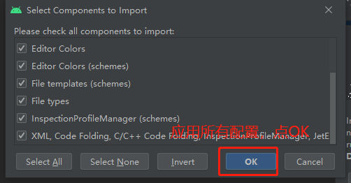

### codestyle

> 日常开发中，使用快捷键`Ctrl + Alt + L`(Mac: `⌘ + ⌥ + L`)格式化代码，可方便地保证基本风格符合标准。

ChangeList：
1. Editor Tabs -> Tab Limit:50
3. Color Scheme -> Android Logcat Colors
4. Code Style -> Hard wrap 120 columns 
5. Java Continuation indent: 4
6. Kotlin Continuation indent: 4
7. File and Code Templates ->File Header
8. File and Code Templates ->New Kotlin Function Body
9. File and Code Templates ->New Kotlin Property Initializer
10. File and Code Templates ->New Kotlin Secondary Constructor Body

### Android Studio 代码风格配置
* 下载对应支持[android Studio的配置文件（zip压缩包） [压缩包下载](version)，如下图所示应用配置:

* 重启Android studio
* 在Settings -> Editor -> Inspections中选择YYAthena并应用 
* 在Settings -> Code Styles -> Scheme中确认YYAthena是否生效。

* 如果发现您的代码报红，可以选择重新格式化，支持批量操作，右键->Reformat Code 

